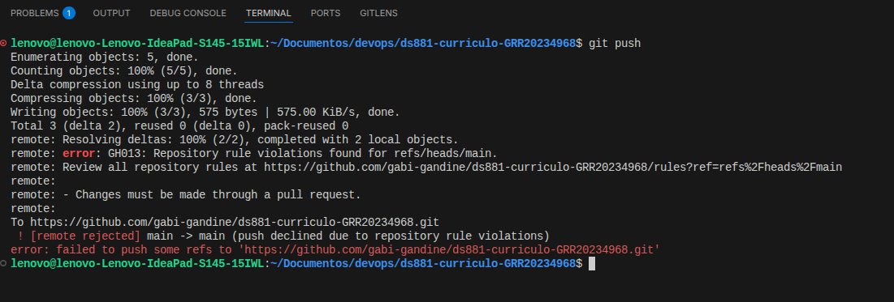
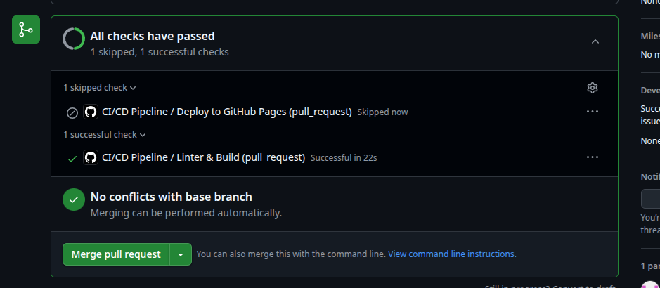

# Projeto Individual: Currículo Online DS881

Este repositório é a atividade prática individual da disciplina DS881. O objetivo é aplicar conceitos de conteinerização, automação de pipeline CI/CD e governança de código em um cenário de projeto real (seu currículo ou portfólio profissional).

Link público do currículo no GitHub Pages - https://gabi-gandine.github.io/ds881-curriculo-GRR20234968/

Para execução local:

1. Clone o repositório usando o comando git clone https://github.com/gabi-gandine/ds881-curriculo-GRR20234968.git
2. Vá para a pasta ds881-curriculo-GRR20234968/cv
3. Execute o comanda docker compose up
4. Espere os passos serem concluídos e acesse o link http://localhost:8080/cv-site 

   

   

## 3. Documentação
O arquivo `README.md` deve conter:
1.  Link público do currículo em produção.
2.  Instruções detalhadas para execução do ambiente local via Docker.
3.  Prints ou descrição da configuração de proteção da branch `main` aplicada no GitHub.

---

## 5. Entrega e Avaliação

A entrega deve ser realizada através do formulário disponibilizado pelo professor, contendo o link do seu repositório público.

---

> **Atenção:** Não esqueça de anexar no final deste README ou na documentação do projeto um print comprovando que a regra de **Branch Protection** da `main` foi configurada no GitHub.
